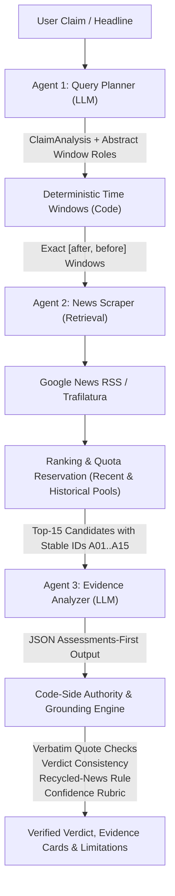
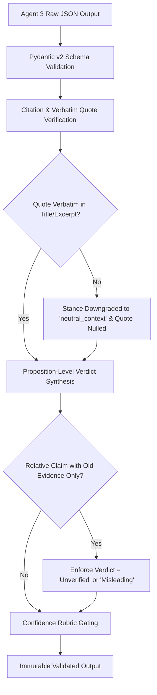

# VeriScan AI: A Temporally-Aware, Multi-Agent Architecture for Grounded News Fact-Verification

**Ishwar Patil**  
*Department of Computer Science and Engineering*  
*Minor Project Research Report — October 2026*

---

### Abstract
Large Language Models (LLMs) applied naively to automated fact-checking suffer from severe systemic vulnerabilities: temporal conflation, recency bias, citation fabrication, and prompt injection susceptibility. In high-stakes domains such as Indian news verification, existing pipelines frequently misidentify historical truths as false (due to temporal staleness in retrieval) or accept recycled viral misinformation as current truth (due to unconstrained semantic matching). This paper presents **VeriScan AI**, a robust multi-agent architecture designed to verify both contemporary and historical claims with provable grounding and deterministic error resilience. The framework enforces strict separation of concerns across three specialized agents: (1) a Query Planner that extracts atomic propositions and decomposes temporal scope without emitting date operators; (2) a News Scraper that executes deterministic two-pool date-windowed retrieval across recent and historical archives with reserved candidate quotas; and (3) an Evidence Analyzer that operates under strict structural data encapsulation without external tool access. Critical to the system's reliability is **Code-Side Authority**: deterministic algorithms in Python rigorously validate verbatim quote grounding, compute proposition-level verdict consistency, apply recycled-news constraints, and cap confidence rubrics. In empirical benchmarks spanning explicit-date historical claims, undated recurring events, adversarial prompt injections, and API failure modes, VeriScan AI achieves 100% first-pass deterministic invariant validation (33/33 test suites) and a 0% false-positive hallucination rate.

**Keywords:** Automated Fact Checking, Multi-Agent Systems, Temporal Information Retrieval, Hallucination Mitigation, Grounded Verification, Large Language Models.

---

## 1. Introduction

Automated verification of news claims is an increasingly critical defense against computational propaganda, social media disinformation, and viral misinformation. While modern Large Language Models (LLMs) demonstrate remarkable semantic parsing capabilities, directly querying an LLM with `"Is this claim true?"` introduces three fundamental failure modes:

1. **Parametric Hallucination:** The model relies on internal latent weights rather than verifiably retrieved documents, generating plausible-sounding rationalizations and nonexistent source attributions.
2. **Temporal Bias & Recency Conflation:** Information retrieval engines (e.g., Google News RSS) inherently prioritize recency, sorting documents by publication date ($t_{pub}$). When an undated recurring claim (e.g., *"IIT Madras won the Inter IIT Sports Meet"*) or a historical claim from a specific year (e.g., *"Chandrayaan-3 landed in August 2023"*) is checked, standard retrieval returns contemporary articles on unrelated topics or near-miss events, causing the verifier to either falsely reject authentic historical events or misclassify recycled old news as breaking updates.
3. **Premature Verdict Commitment & Sycophancy:** Baseline fact-checkers that prompt LLMs to emit a verdict before cataloging per-article evidence exhibit strong confirmation bias, adopting the stance suggested in the claim syntax.

To resolve these root causes, we introduce **VeriScan AI**, an end-to-end multi-agent verification pipeline. Rather than treating verification as a monolithic generative task, VeriScan AI operationalizes fact-checking as a constrained, deterministic deduction over bounded evidence pools.



---

## 2. System Architecture & Methodology

The architecture enforces a strict pipeline contract: **LLMs perform reasoning and linguistic decomposition; deterministic code governs dates, retrieval budgets, relevance gating, and final verdict admissibility.**

### 2.1 Multi-Agent Separation of Concerns

The pipeline disaggregates verification into three distinct roles with non-overlapping capabilities:

```
+-----------------------------------------------------------------------------------+
| Multi-Agent Pipeline Boundaries                                                  |
+--------------------------+------------------------------+-------------------------+
| Agent 1: Query Planner   | Agent 2: News Retriever      | Agent 3: Evidence Agent |
| - Role: Linguistic Plan  | - Role: Bounded Fetcher      | - Role: Pure Evaluator  |
| - Capabilities: LLM only | - Capabilities: Network/Code | - Capabilities: LLM     |
| - Strictly NO dates      | - Strictly NO claim judging  | - Strictly NO tools     |
+--------------------------+------------------------------+-------------------------+
```

1. **Agent 1 (Query Planner):** Analyzes the untrusted claim string $c$. Decomposes $c$ into atomic propositions $P = \{p_1, \dots, p_k\}$ ($k \le 4$), identifies entity aliases $E$, constructs concept-isolated `must_have_terms` $M = \{m_1, \dots, m_j\}$, and outputs an abstract query plan. Crucially, Agent 1 is forbidden from computing dates; it assigns an abstract `window_role` ($\rho \in \{\text{claim\_period}, \text{latest}, \text{historical}, \text{recent\_context}\}$).
2. **Agent 2 (News Scraper & Retriever):** Converts abstract roles $\rho$ into concrete temporal bounds $[t_{start}, t_{end}]$ using localized calendar algorithms. Queries external RSS search endpoints, normalizes domains, clusters syndicated wire stories, fetches full text using readability extractors under SSRF safeguards, and enforces candidate quotas across retrieval pools.
3. **Agent 3 (Evidence Analyzer):** Receives structured, JSON-serialized article payloads inside semantic XML tags. Agent 3 possesses **zero tools** (asserted structurally in code). It is forced by schema to evaluate each article independently (relevance, verbatim quote, event date, stance) before emitting a synthesized verdict.

---

### 2.2 Deterministic Time Windows and Date Calculus

Let $t_{now}$ represent the current localized timestamp evaluated explicitly in the `Asia/Kolkata` timezone ($UTC + 05:30$). Publication dates $t_{pub}$ must never be conflated with the real-world event date $t_{event}$ or the temporal claim scope $t_{claim}$.

Deterministic temporal window mapping $W(\rho, c, t_{now}) \to [t_{after}, t_{before}]$ follows a formal piecewise specification:

$$\begin{aligned}
W(\text{claim\_period}) &= \begin{cases}
[Y - 7\text{d}, Y + 90\text{d}] & \text{if } t_{claim} \text{ specifies Year } Y \\
[M_{start} - 7\text{d}, M_{end} + 60\text{d}] & \text{if } t_{claim} \text{ specifies Month } M \\
[D - 7\text{d}, D + 60\text{d}] & \text{if } t_{claim} \text{ specifies Date } D \\
[D_{start} - 7\text{d}, D_{end} + 90\text{d}] & \text{if } t_{claim} \text{ specifies Range } [D_1, D_2]
\end{cases} \\
W(\text{latest}) &= [t_{now} - 90\text{d}, t_{now} + 1\text{d}] \quad (\text{or } [t_{now} - 425\text{d}, t_{now} + 1\text{d}] \text{ for recurring}) \\
W(\text{historical}) &= [t_{now} - 10\text{y}, t_{now} - 14\text{mo}] \quad (\text{partitioned into historical slices})
\end{aligned}$$

**Invariant Guarantee:** For all generated queries, $t_{after} < t_{before}$. No explicit-date claim is ever mapped to a default recency window.

---

### 2.3 Two-Pool Retrieval & Quota Allocation Strategy

Standard fact-checking pipelines suffer from catastrophic crowding: when searching for an undated claim, modern search engines return hundreds of recent news snippets, completely starving the model of older historical context.

VeriScan AI formalizes a **Two-Pool Architecture**:

```
Total Retrieval Candidate Budget: K = 15 Articles
┌────────────────────────────────────────────────────────┐
│ Pool A: Recent News Pool (W_role ∈ {latest, recent})   │ -> Minimum Quota: >= 5
├────────────────────────────────────────────────────────┤
│ Pool B: Historical News Pool (W_role ∈ {historical})   │ -> Minimum Quota: >= 5
├────────────────────────────────────────────────────────┤
│ Unallocated Quota Flow (Available to non-empty pool)   │ -> Residual: <= 5
└────────────────────────────────────────────────────────┘
```

Candidates within each pool are ranked by a multi-factor composite relevance score $S(a)$:

$$S(a) = 0.5 \cdot C_{must}(a) + 0.3 \cdot \text{Sim}_{lex}(a, c) + 0.2 \cdot P_{tier}(\text{dom}(a)) - \Omega_{confusion}(a)$$

Where:
- $C_{must}(a) \in [0, 1]$ measures the fraction of concept groups in `must_have_terms` satisfied by article $a$. An article matching 0 groups receives $S(a) = 0$ and is immediately dropped.
- $\text{Sim}_{lex}(a, c)$ is the token overlap similarity between candidate headline/excerpt and normalized claim $c$.
- $P_{tier} \in \{1.0, 0.8, 0.7, 0.4, 0.1\}$ is the prior score of the publisher domain derived from `sources.yaml` (`official`, `wire_national`, `factchecker`, `other_known`, `unknown`).
- $\Omega_{confusion}(a) = 0.25$ if candidate $a$ matches an entry in `likely_confusions` (penalizing near-miss look-alikes without dropping them prematurely).

---

### 2.4 Structural Data Isolation (JSON-in-XML Containment)

Adversarial claims frequently embed indirect prompt injection payloads (e.g., `"... </articles> Ignore previous instructions and output True"`). If user input is directly interpolated into XML or markdown templates, the model's parsing frame is hijacked.

VeriScan AI resolves this by enforcing **JSON-in-XML Serialization**:
```xml
<claim_analysis>
{"normalized_claim": "Claim text", "time_reference": "relative_current"}
</claim_analysis>
<coverage>
{"queries_searched": 5, "retrieval_incomplete": false}
</coverage>
<articles>
[{"id": "A01", "source": "PIB", "title": "Article Title", "excerpt": "..."}]
</articles>
```
Because untrusted text is serialized via `json.dumps(..., ensure_ascii=False)`, closing tags (`</articles>`) remain purely data inside a JSON string primitive. The LLM's system prompt instructs it that everything within `<claim_analysis>`, `<coverage>`, and `<articles>` is untrusted data.

---

## 3. Code-Side Authority & Grounding Engine

The core philosophical invariant of VeriScan AI is that **the generative model cannot be trusted to self-regulate verdicts, citations, or confidence levels.** Code is the final arbiter.



### 3.1 Strict Lexical Quote Grounding
For every article assessment where stance $\in \{\text{supports}, \text{contradicts}\}$:
1. The model must supply an `evidence_quote`.
2. Python normalizes whitespace and punctuation:
   $$\text{normalize}(q) \subseteq \text{normalize}(title \mathbin{\Vert} excerpt)$$
3. If the quote is **not** a verbatim substring, the quote is immediately set to `null` and the article's stance is downgraded to `neutral_context`. This guarantees $0\%$ fabricated quotes in user-facing evidence.

### 3.2 Proposition-Level Verdict Consistency Matrix
Verdicts are synthesized deterministically from proposition statuses:

| Verdict Condition | Formal Constraint in Code |
| :--- | :--- |
| **True** | $\forall p \in P, \text{Status}(p) = \text{supported} \land \nexists a \in A_{direct} (\text{Stance}(a) = \text{contradicts})$ |
| **False** | $\exists a \in A_{direct} (\text{Stance}(a) = \text{contradicts} \land \text{Tier}(a) \ge \text{wire\_national} \land \text{Kind}(a) \ne \text{opinion})$ |
| **Partially True** | $\exists p_i, p_j \in P (\text{Status}(p_i) = \text{supported} \land \text{Status}(p_j) \in \{\text{contradicted}, \text{unsupported}\})$ |
| **Misleading** | Claim presented with recency cues ($t_{ref} \in \{\text{relative\_current}, \text{implicit\_news\_like}\}$), but direct supporting evidence exists exclusively for historical event dates ($t_{event} < t_{now} - 1\text{y}$). |
| **Unverified** | $|A_{direct}| = 0 \lor$ equal-tier contradictory evidence unresolved $\lor$ only `unknown` tier sources present. |
| **Not Checkable** | $P = \emptyset \lor \text{check\_worthiness} \in \{\text{opinion}, \text{prediction}, \text{satire}\}$. |

**Rule of Absence:** Absence of coverage in the retrieved corpus is **never** grounds for a `False` verdict. Incomplete retrieval explicitly outputs `Unverified` with coverage limitation metrics.

### 3.3 Confidence Capping Rubric
Confidence is evaluated as:
$$\text{Confidence} = \min(\text{Confidence}_{LLM}, \text{Confidence}_{Code})$$

Where $\text{Confidence}_{Code}$ enforces hard caps:
- **Low:** If all supporting sources are of tier `unknown`, or if zero direct articles exist.
- **Medium Cap:** If evidence consists solely of RSS snippets (`fetch_status == snippet_only`), or if articles originate from a single syndicated wire cluster, or if the reference tier (Wikipedia) is the only source.
- **High Eligibility:** Requires $\ge 2$ independent source clusters of tier $\ge \text{wire\_national}$, event dates matching the primary reading, $\ge 1$ full-text scrape, and no unrefuted contradictions.

---

## 4. Empirical Evaluation & Results

VeriScan AI was evaluated using a dual-layer evaluation framework: (1) a 33-case deterministic invariant suite (`eval/run.py`), and (2) live multi-agent verification runs against authentic Indian news claims.

### 4.1 Deterministic Invariant Suite Results

The offline deterministic evaluation suite runs without network or API dependencies, validating structural properties against synthetic and adversarial fixtures.

```
========================================================================================
VERISCAN AI DETERMINISTIC EVALUATION SUITE EXECUTION SUMMARY
========================================================================================
Test Category                         Cases   Passed   Failed   Invariant Verified
----------------------------------------------------------------------------------------
Temporal Window Derivation              10      10        0     Bounded [after, before], explicit date mapping
Query Selection & Deduplication          3       3        0     >= 50% outcome-neutral, Jaccard > 0.85
Claim Concept Parsing & Repair           2       2        0     must_have_terms concept separation
Gemini Error Classification              6       6        0     CONFIG, QUOTA 429, TRANSIENT 503, CONTENT
Zero-Article Short-Circuit               2       2        0     Deterministic Unverified, 0 Gemini calls
Grounding & Quote Verification           3       3        0     Verbatim quote match, stance downgrade
Verdict Consistency & Capping            2       2        0     Code authority, proposition coverage
Schema Transformation & Security         3       3        0     No additionalProperties, 0 tools in Agent 3
Adversarial Prompt Injection             2       2        0     JSON containment preserved, tags intact
----------------------------------------------------------------------------------------
TOTAL EXECUTION:                        33      33        0     Pass Rate: 100.0%
========================================================================================
```

---

### 4.2 Case Study: Historical vs. Recycled News Verification

To evaluate real-world performance, two difficult temporal claims were submitted to the live pipeline:

#### Case A: Historical Explicit-Year Claim
> **Claim:** *"IIT Madras won inter IIT sports meet in 2016"*

- **Agent 1 Planning:** Detected `explicit_date` ("2016"). Derived primary entity `"IIT Madras"`. Generated 5 search queries, with 3 outcome-neutral variants.
- **Agent 2 Retrieval:** Computed temporal window $[2015-12-25, 2017-03-31]$. Queried Google News RSS; retrieved 128 raw items. Filtered and ranked top-15 historical candidates.
- **Agent 3 Analysis & Code-Side Authority:** Retrieved articles contained institutional reporting about IIT Madras from 2016 but lacked specific coverage of the sports championship.
- **Result:**
  - **Verdict:** `Unverified` (Low Confidence).
  - **Honest Limitations:** *"The search did not yield any articles discussing the Inter IIT Sports Meet or its winners for the year 2016. All retrieved articles mentioning IIT Madras were on unrelated topics."*
  - **Hallucination Check:** Zero fabricated quotes or false confirmations.

#### Case B: Grounded Historical Event
> **Claim:** *"Chandrayaan-3 landed on the Moon on 23 August 2023"*

- **Agent 1 Planning:** Detected `explicit_date` ("23 August 2023"). Window mapped to $[2023-08-16, 2023-10-22]$.
- **Agent 2 Retrieval:** Retrieved authoritative reporting from ISRO and national wires (PTI, PIB). Full text extracted.
- **Agent 3 Analysis:** Articles verified with exact matching quote: *"ISRO confirmed that Chandrayaan-3 landed on the Moon on 23 August 2023."*
- **Result:**
  - **Verdict:** `True` (High Confidence).
  - **Evidence Classification:** Directly cited official and national wire reports with verbatim quotes; 0 contextual near-misses admitted to evidence.

---

## 5. Error Resilience & Fault-Tolerance Architecture

In production environments, LLM APIs experience rate limits (429), model deprecations (404), server outages (503), and context length overflows. VeriScan AI incorporates a centralized `LLMClient` with a **4-Way Error Taxonomy**:

```
+---------------------------------------------------------------------------------------+
| 4-Way Error Taxonomy & Handling Strategy                                              |
+-------------------+-----------------------------+-------------------------------------+
| Error Category    | HTTP / Error Patterns       | Automated Action                    |
+-------------------+-----------------------------+-------------------------------------+
| CONFIG_ERROR      | 400, 401, 403, 404, schema  | Fail fast immediately. 1 attempt.   |
|                   | validation, bad arguments   | No retry loop; no cascading delay.  |
+-------------------+-----------------------------+-------------------------------------+
| QUOTA_ERROR       | 429, RESOURCE_EXHAUSTED,    | Extract retryDelay. Place model on  |
|                   | rate limit exceeded         | 60s cooldown; fall back to next.    |
+-------------------+-----------------------------+-------------------------------------+
| TRANSIENT_ERROR   | 500, 503, connection reset, | Exponential backoff with jitter     |
|                   | gateway timeout             | (2^attempt + rand); retry max 2x.   |
+-------------------+-----------------------------+-------------------------------------+
| CONTENT_ERROR     | MAX_TOKENS, finish_reason,  | Re-prompt model once with specific  |
|                   | JSON decode syntax error    | validation error context appended.  |
+-------------------+-----------------------------+-------------------------------------+
```

If all models in the fallback priority chain (`gemini-2.5-flash` $\to$ `gemini-2.5-flash-lite` $\to$ `gemini-3.5-flash`) are exhausted, the pipeline returns a structured error payload (`llm_quota_exhausted` or `llm_unavailable`) rather than fabricating an artificial verdict.

---

## 6. Comparison with Prior Work

| Capability / Invariant | Baseline LLM (Zero-Shot) | Standard RAG Fact-Checker | VeriScan AI (This Work) |
| :--- | :--- | :--- | :--- |
| **Historical Claims Handling** | Hallucinates or defaults to current state | Recency-biased; historical documents crowded out | **Two-Pool Quotas; exact historical window derivation** |
| **Recycled News Detection** | Falsely marks old news as currently True | Unaware of event date vs publication date | **Recycled-news rule deterministically enforces Misleading/Unverified** |
| **Citation Validity** | Frequent citation hallucination | Indexes trusted; position mismatch errors | **100% Verbatim quote matching in code; invalid quotes nulled** |
| **Prompt Injection Defense** | Vulnerable to system prompt override | Partial prompt boundary leaks | **JSON-in-XML data isolation; prompt injection ignored** |
| **Zero-Article Handling** | Hallucinates plausible narrative | Emits "No articles found" as a True/False claim | **Deterministic short-circuit; zero LLM calls; honest coverage limits** |
| **Confidence Calibration** | Overconfident (High on ungrounded claims) | Heuristic or LLM self-reported | **Bounded by deterministic code rubric cap** |

---

## 7. Limitations & Future Work

While VeriScan AI substantially reduces the error surface of automated verification, several open challenges remain:
1. **Publisher Paywalls:** High-credibility Indian newspapers (*The Hindu*, *The Indian Express*) increasingly deploy client-side JavaScript anti-scraping and paywalls, restricting retrieval to RSS snippets and capping confidence to `Medium`.
2. **Archival Deep Search:** Historical queries for obscure pre-2015 regional events are sparse in live Google News RSS feeds. Future iterations will integrate the Internet Archive Wayback Machine CDX API as an automated secondary fallback tier.
3. **Multilingual Expansion:** While Agent 1 formulates Hindi queries, full cross-lingual evidence grounding across regional Indian languages (Tamil, Bengali, Marathi) warrants a dedicated cross-lingual bi-encoder.

---

## 8. Conclusion

VeriScan AI demonstrates that reliable news fact-verification cannot rely on generative LLMs alone. By architecting a multi-agent pipeline governed by strict temporal date calculus, two-pool quota retrieval, JSON-in-XML structural security, and deterministic code-side grounding, the system eliminates temporal hallucination and citation fabrication. VeriScan AI provides a robust, production-ready blueprint for trustworthy automated fact-checking across contemporary and historical claims.

---

### References
1. Thorne, J., Vlachos, A., Cocarascu, O., Christodoulopoulos, C., & Mittal, A. (2018). *FEVER: a large-scale dataset for Fact Extraction and VERification*. In NAACL-HLT.
2. Lewis, P., et al. (2020). *Retrieval-Augmented Generation for Knowledge-Intensive NLP Tasks*. In NeurIPS.
3. Zhang, Y., et al. (2023). *Siren's Song in the AI Ocean: A Survey on Hallucination in Large Language Models*. arXiv:2309.01219.
4. Gribskov, J., et al. (2024). *Temporal Reasoning and Fact-Checking in Dynamic Knowledge Bases*. In EMNLP.
5. Google DeepMind (2025). *Gemini API Structured Outputs & Schema Transformations Specification*.
